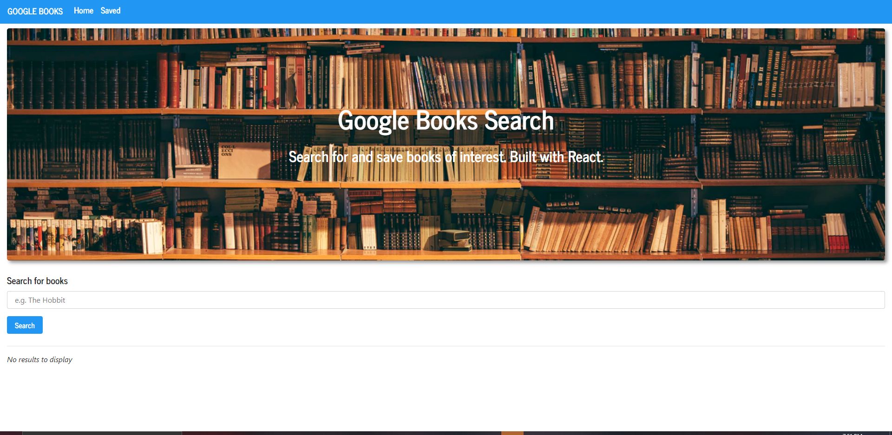
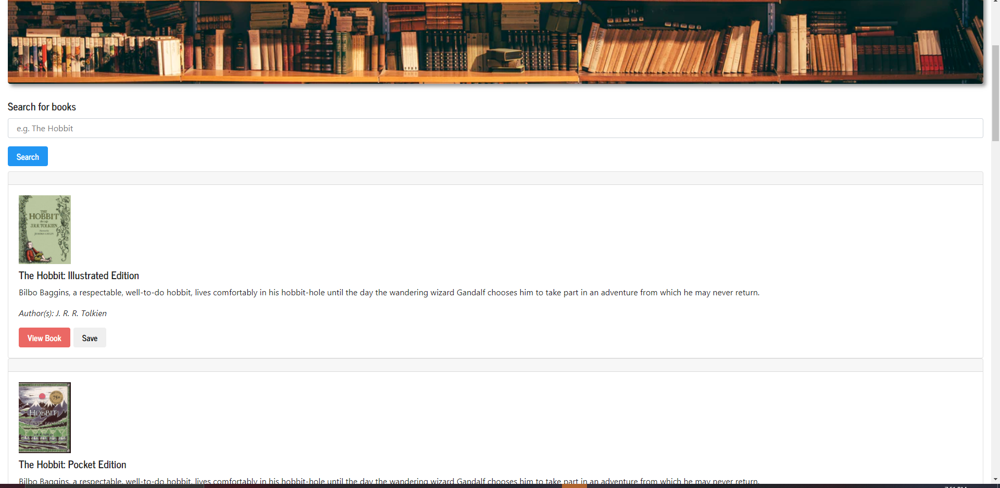
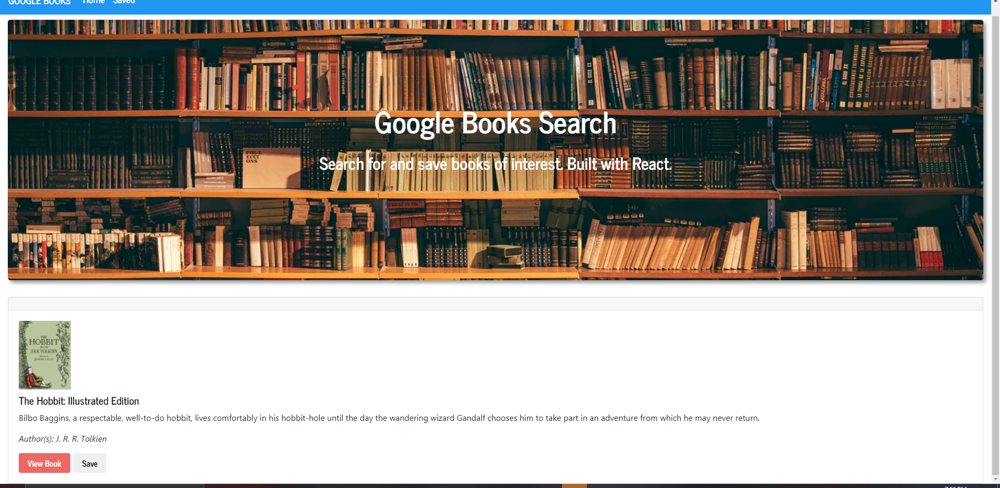

# PWA-Budget-Tracker





## Description
This application allows a user to search books using the Google books API.  Once a user has searched for a book they can then look at the book by clicking a button that will redirect them to that book's page.  They can also save books they are interested in to a database.

-[Installation](#installation)

-[Deployed](#Deployed)

-[Usage](#usage)

-[License](#license)

-[Contributing](#contributing)

-[Tests](#tests)

-[Questions](#questions)

## Installation

In order to run this script you have to have the following things downloaded using npm i.
```
    "axios",
    "express"
    "gh-pages"
    "if-env"
    "mongoose"
    "react-router-dom"
```

## Deployed


## Usage

This application is web based and as such can only be used to view the code I have written.  It is also deployed to heroku.
## License

N/A


## Contributing
Contributing to this file is not yet available as it is a personal homework project.  Check back in the future for other projects to contribute on.

## Tests

To run tests, run the following command:

```
N/A
```

## Questions

### Github:
github.com/GreysonMainor

### Email:
gbmainor98@outlook.com
  